# Neural Networks and Backpropagation

---

# Agenda

* Neural networks

* Backpropagation

* Best practices

* Workshop

---

# NEURAL NETWORKS

---

# Introduction

* Classification
    * Pattern recognition (image, medical diagnosis, …)
    * Sequence recognition (printed text, handwriting, speech)
* Regression analysis (function approximation)
    * Time series prediction
* Other
    * Novelty detection (fraud detection)
    * Data compression (auto-encoders)
* Great investment in industry and academia

---

# History

* Inspired by human nervous system

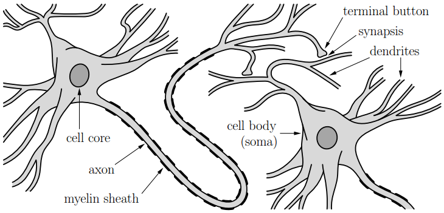

---

# History

* 1960 - Perceptron
    * Limited to linearly separable problems
:::::: container {.two_columns .min_content}
::: container
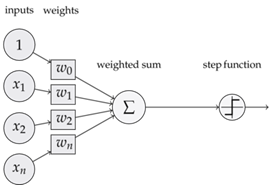
:::
::: container
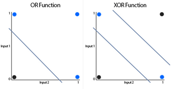
::::::

  * Insufficient compute power to perform training
* Stagnant until ~1980

---

# History

:::::: container {.two_columns}
::: container
* 1980-1995 – Multilayer perceptron
  * Universal approximator
  * Enough compute power
* 1995 - Stagnant again
  * More complex problems, lacks data and compute
  * Other techniques more popular (SVM)
* 2006 – Deep neural networks
  * Increase number of layers (higher abstraction level)
  * Large datasets GPU compute
* Very popular technique until today
:::
::: container
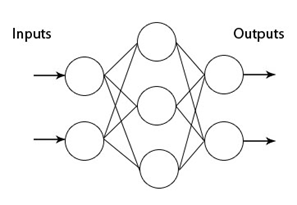
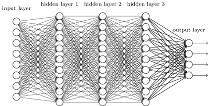
::::::
---
# Neural Network types

:::::: container {.two_columns}
::: container
* Feed forward
  * Fully connected

    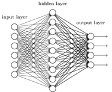

  * Convolutional
  
    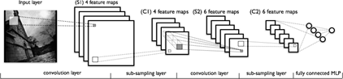
:::
::: container
* Recurrent

    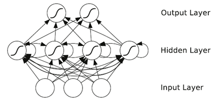
::::::
---

# FF Neural Networks - Neuron

:::::: container {.two_columns}
::: container
* Neuron – basic building block
  * Input vector
    * $\vec{x}=[x_1, x_2, ..., x_M]^T$
  * Weights vector
    * $\vec{w}=[w_1, w_2, ..., w_M]$
  * Bias $b$
  * Pre-activation
    * $v=\sum_{i} x_i w_i + b$
  * $v$ is dot product of inputs
    * $v=\vec{w}\cdot\vec{x} + b$
:::
::: container

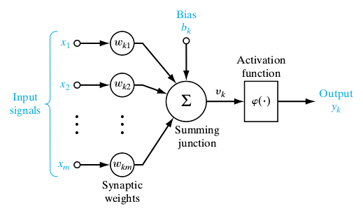

::::::

---

# FF Neural Networks – Activation Function

:::::: container {.three_columns}
::: container
* $\phi$ must be nonlinear
  * Sigmoid
    * $f(x) = \frac{{1}}{{1} + e^{-x} }$
  * Hyperbolic tanget
    * $f(x) = \frac{{1 - e^{-2x}}}{{1} + e^{-2x} }$
  * Linear rectifier
    * $f(x)=max(0,x)$
* Neuron output
    * $y = f(\vec{v}) = \phi(\sum_{i} x_i w_i + b)$
    
:::
::: container

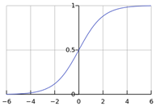

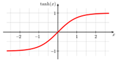

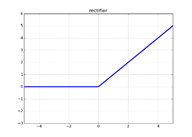

:::
::: container

:::
::::::

---

# FF Neural Networks – Neuron Capacity

* Can solve just linearly separable problems

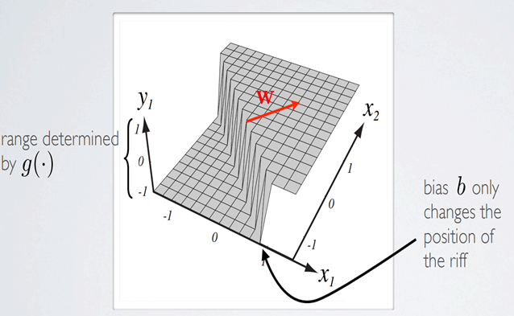

---

# FF Neural Networks - Layer

:::::: container {.two_columns}
::: container
* Multiple neurons
  * Same input - vector
    * $\vec{x}=[x_1, x_2, ..., x_M]^T$
  * Different weights per k neurons - matrix
    $$ W=\begin{bmatrix} w_{11} & \dots & w_{1M} \\ \vdots & \ddots & \vdots \\ w_{K1} & \dots & w_{KM} \end{bmatrix} = \begin{bmatrix} \vec{w_1} \\ \vdots \\ \vec{w_k} \end{bmatrix} $$
  * Pre-activation vector $v$
    * $\vec{v}=W\vec{x} + \vec{b}=[v_1, ..., v_K]^T$
  * Output vector
    * $\vec{v}=\phi(\vec{v})=[y_1, ..., y_K]^T$
    * $\vec{v}=\phi(W\vec{x} + \vec{b})$ -> __Needed for excersise__
:::
::: container

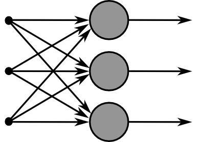

::::::

---

# FF Neural Networks - Network

:::::: container {.two_columns}
::: container

* Combination of two layers
    * Hidden layer
        * Extract features
    * Output layer
        * Makes a decision
* Can model arbitrarily complex function
* Why is nonlinearity important?

:::
::: container

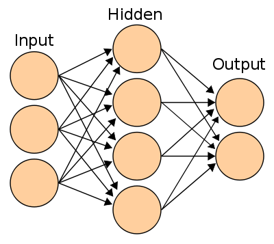

::::::

---

# FF Neural Networks - Softmax

* Nonlinearity used just in output layer
    * $y_k=\frac{e^{v_k}}{\sum_{i} e^{v_i}}$
    * $\vec{y}=softmax(\vec{v})$ -> Elementwise softmax (__Needed for exercise__)
* Introduces correlation between outputs
    * Outputs compete for limited resource
    * Better convergence
* Outputs sums to 1
    * Interpret outputs as probability distribution
    * Convenient for classification problems

---

# FF Neural Networks – Network Capacity

* Models arbitrarily complex functions

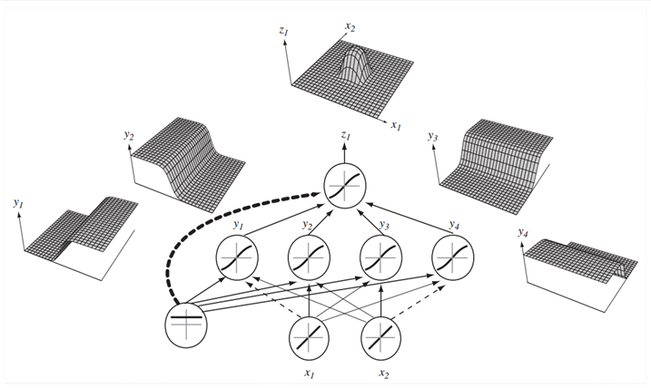

---

# Pros and Cons

* Pros
    * Approximation of arbitrary function
    * Superior performance on challenging recognition tasks (images, speech)
    * Convenient for parallelization (e.g. CPU, GPU)
* Cons
    * Many hyper parameters need to be chosen before training
    * Training might not converge to the optimal model

---

# BACKPROPAGATION