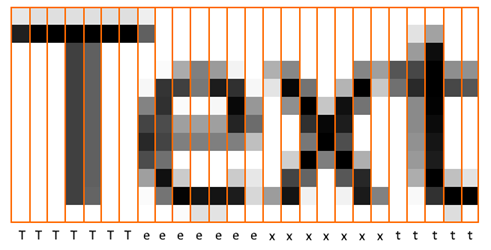

# Recurrent neural networks

## Nikola Milosavljevic

### PSIML 2019

---

# Recurrent neural networks (RNNs)

* Family of neural networks for **sequential** processing of data
* Suitable where input and/or output are one-dimensional sequences (in space or time)
    * Recognizing lines of text
    * Translating written sentences
    * Transcribing spoken sentences
    * Describing images or videos by text

---

# "Vanilla" neural networks

* Multilayer perceptrons and convolutional neural networks
* Input and output viewed as a single item

:::container {.center}
@graphviz_open
digraph G {
    rankdir="BT"
    in [shape=box, color=white]; func [shape=box]; out [shape=box, color=white];
    in->func->out;
}
@graphviz_close
:::

---

# Recurrent neural networks

* Input processed as a sequence, output produced as a sequence
* Compute output based on the input seen so far
* Maintain **state** which accumulates information from sequence seen so far
* Network size is proportional to length of the sequence

:::container {.center}
@graphviz_open
digraph G {
    rankdir="LR";
    subgraph {
        rank=same;
        out1 [shape=box, label=<out1>, color=white];
        func1 [shape=box, label=<func1>];
        in1 [shape=box, label=<in1>, color=white];
        in1->func1->out1 [constraint=false];
    };
    state1 [shape=box, label=<state1>, color=white];
    subgraph {
        rank=same;
        out2 [shape=box, label=<out2>, color=white];
        func2 [shape=box, label=<func2>];
        in2 [shape=box, label=<in2>, color=white];
        in2->func2->out2 [constraint=false];
    };
    state2 [shape=box, label=<state2>, color=white];
    subgraph {
        rank=same;
        out3 [shape=box, label=<out3>, color=white];
        func3 [shape=box, label=<func3>];
        in3 [shape=box, label=<in3>, color=white];
        in3->func3->out3 [constraint=false];
    };
    state3 [shape=box, label=<state3>, color=white];
    subgraph {
        rank=same;
        out4 [shape=box, label=<out4>, color=white];
        func4 [shape=box, label=<func4>];
        in4 [shape=box, label=<in4>, color=white];
        in4->func4->out4 [constraint=false];
    };
    state4 [shape=box, label=<state4>, color=white];
    func1->state1->func2->state2->func3->state3->func4->state4;
    // Enforcing alignment.
    out1->out2->out3->out4 [style=invis];
}
@graphviz_close
:::

---

# Input/output correspondence

* Inputs and outputs need not correspond one to one
* Labels may be provided per frame of input, but they are usually not!
    * Expensive to label
    * Sometimes labeling not unique (e.g. speech)
* Special encoding of input/output

 {.center}

---

# Applications: with correspondence

* Speech recognition
* Handwriting recognition

:::container {.center}
@graphviz_open
digraph G {
    rankdir="LR";
    subgraph {
        rank=same;
        out1 [shape=box, label=<symbol1>, color=white];
        func1 [shape=box, label=""];
        in1 [shape=box, label=<column1>, color=white];
        in1->func1->out1 [constraint=false];
    };
    subgraph {
        rank=same;
        out2 [shape=box, label=<symbol2>, color=white];
        func2 [shape=box, label=""];
        in2 [shape=box, label=<column2>, color=white];
        in2->func2->out2 [constraint=false];
    };
    subgraph {
        rank=same;
        out3 [shape=box, label=<symbol3>, color=white];
        func3 [shape=box, label=""];
        in3 [shape=box, label=<column3>, color=white];
        in3->func3->out3 [constraint=false];
    };
    subgraph {
        rank=same;
        out4 [shape=box, label=<symbol4>, color=white];
        func4 [shape=box, label=""];
        in4 [shape=box, label=<column4>, color=white];
        in4->func4->out4 [constraint=false];
    };
    subgraph {
        rank=same;
        out5 [shape=box, label=<symbol5>, color=white];
        func5 [shape=box, label=""];
        in5 [shape=box, label=<column5>, color=white];
        in5->func5->out5 [constraint=false];
    };
    subgraph {
        rank=same;
        out6 [shape=box, label=<symbol6>, color=white];
        func6 [shape=box, label=""];
        in6 [shape=box, label=<column6>, color=white];
        in6->func6->out6 [constraint=false];
    };
    func1->func2->func3->func4->func5->func6;
    // Enforcing alignment.
    out1->out2->out3->out4->out5->out6 [style=invis];
}
@graphviz_close
:::

 {.center}

---

# Applications: without correspondence

* Machine translation

:::container {.center}
@graphviz_open
digraph G {
    rankdir="LR";
    subgraph {
        rank=same;
        out1 [shape=box, label="", color=white];
        func1 [shape=box, label=""];
        in1 [shape=box, label=<English word1>, color=white];
        in1->func1 [constraint=false];
        func1->out1 [constraint=false, style=invis];
    };
    subgraph {
        rank=same;
        out2 [shape=box, label="", color=white];
        func2 [shape=box, label=""];
        in2 [shape=box, label=<English word2>, color=white];
        in2->func2 [constraint=false];
        func2->out2 [constraint=false, style=invis];
    };
    subgraph {
        rank=same;
        out3 [shape=box, label=<French word1>, color=white];
        func3 [shape=box, label=""];
        in3 [shape=box, label="", color=white];
        in3->func3 [constraint=false, style=invis];
        func3->out3 [constraint=false];
    };
    subgraph {
        rank=same;
        out4 [shape=box, label=<French word2>, color=white];
        func4 [shape=box, label=""];
        in4 [shape=box, label="", color=white];
        in4->func4 [constraint=false, style=invis];
        func4->out4 [constraint=false];
    };
    subgraph {
        rank=same;
        out5 [shape=box, label=<French word3>, color=white];
        func5 [shape=box, label=""];
        in5 [shape=box, label="", color=white];
        in5->func5 [constraint=false, style=invis];
        func5->out5 [constraint=false];
    };
    subgraph {
        rank=same;
        out6 [shape=box, label=<French word4>, color=white];
        func6 [shape=box, label=""];
        in6 [shape=box, label="", color=white];
        in6->func6 [constraint=false, style=invis];
        func6->out6 [constraint=false];
    };
    func1->func2->func3->func4->func5->func6;
    // Enforcing alignment.
    out1->out2->out3->out4->out5->out6 [style=invis];
}
@graphviz_close
:::

---

# Applications: single output

* Review sentiment analysis
* Action classification

:::container {.center}
@graphviz_open
digraph G {
    rankdir="LR";
    subgraph {
        rank=same;
        out1 [shape=box, label="", color=white];
        func1 [shape=box, label=""];
        in1 [shape=box, label=<video frame1>, color=white];
        in1->func1 [constraint=false];
        func1->out1 [constraint=false, style=invis];
    };
    subgraph {
        rank=same;
        out2 [shape=box, label="", color=white];
        func2 [shape=box, label=""];
        in2 [shape=box, label=<video frame2>, color=white];
        in2->func2 [constraint=false];
        func2->out2 [constraint=false, style=invis];
    };
    subgraph {
        rank=same;
        out3 [shape=box, label="", color=white];
        func3 [shape=box, label=""];
        in3 [shape=box, label=<video frame3>, color=white];
        in3->func3 [constraint=false];
        func3->out3 [constraint=false, style=invis];
    };
    subgraph {
        rank=same;
        out4 [shape=box, label="", color=white];
        func4 [shape=box, label=""];
        in4 [shape=box, label=<video frame4>, color=white];
        in4->func4 [constraint=false];
        func4->out4 [constraint=false, style=invis];
    };
    subgraph {
        rank=same;
        out5 [shape=box, label="", color=white];
        func5 [shape=box, label=""];
        in5 [shape=box, label=<video frame5>, color=white];
        in5->func5 [constraint=false];
        func5->out5 [constraint=false, style=invis];
    };
    subgraph {
        rank=same;
        out6 [shape=box, label="action", color=white];
        func6 [shape=box, label=""];
        in6 [shape=box, label="", color=white];
        in6->func6 [constraint=false, style=invis];
        func6->out6 [constraint=false];
    };
    func1->func2->func3->func4->func5->func6;
    // Enforcing alignment.
    out1->out2->out3->out4->out5->out6 [style=invis];
}
@graphviz_close
:::

---

# Applications: single input

* Image description (captioning)

:::container {.center}
@graphviz_open
digraph G {
    rankdir="LR";
    subgraph {
        rank=same;
        out1 [shape=box, label="", color=white];
        func1 [shape=box, label=""];
        in1 [shape=box, label="image", color=white];
        in1->func1 [constraint=false];
        func1->out1 [constraint=false, style=invis];
    };
    subgraph {
        rank=same;
        out2 [shape=box, label=<word1>, color=white];
        func2 [shape=box, label=""];
        in2 [shape=box, label="", color=white];
        in2->func2 [constraint=false, style=invis];
        func2->out2 [constraint=false];
    };
    subgraph {
        rank=same;
        out3 [shape=box, label=<word2>, color=white];
        func3 [shape=box, label=""];
        in3 [shape=box, label="", color=white];
        in3->func3 [constraint=false, style=invis];
        func3->out3 [constraint=false];
    };
    subgraph {
        rank=same;
        out4 [shape=box, label=<word3>, color=white];
        func4 [shape=box, label=""];
        in4 [shape=box, label="", color=white];
        in4->func4 [constraint=false, style=invis];
        func4->out4 [constraint=false];
    };
    subgraph {
        rank=same;
        out5 [shape=box, label=<word4>, color=white];
        func5 [shape=box, label=""];
        in5 [shape=box, label="", color=white];
        in5->func5 [constraint=false, style=invis];
        func5->out5 [constraint=false];
    };
    subgraph {
        rank=same;
        out6 [shape=box, label=<word5>, color=white];
        func6 [shape=box, label=""];
        in6 [shape=box, label="", color=white];
        in6->func6 [constraint=false, style=invis];
        func6->out6 [constraint=false];
    };
    func1->func2->func3->func4->func5->func6;
    // Enforcing alignment.
    out1->out2->out3->out4->out5->out6 [style=invis];
}
@graphviz_close
:::

---

# Adaptable network size

* Trained network can have a fixed set of weights
* Idea: all steps in the sequence share the same weight

:::container {.center}
@graphviz_open
digraph G {
    rankdir="LR";
    subgraph {
        rank=same;
        out1 [shape=box, label=<out1>, color=white];
        func1 [shape=box, fontcolor=red, label=<func1>];
        in1 [shape=box, label=<in1>, color=white];
        in1->func1 [constraint=false];
        func1->out1 [constraint=false];
    };
    subgraph {
        rank=same;
        out2 [shape=box, label=<out2>, color=white];
        func2 [shape=box, fontcolor=red, label=<func2>];
        in2 [shape=box, label=<in2>, color=white];
        in2->func2 [constraint=false];
        func2->out2 [constraint=false];
    };
    subgraph {
        rank=same;
        out3 [shape=box, label=<out3>, color=white];
        func3 [shape=box, fontcolor=red, label=<func3>];
        in3 [shape=box, label=<in3>, color=white];
        in3->func3 [constraint=false];
        func3->out3 [constraint=false];
    };
    subgraph {
        rank=same;
        out4 [shape=box, label=<out4>, color=white];
        func4 [shape=box, fontcolor=red, label=<func4>];
        in4 [shape=box, label=<in4>, color=white];
        in4->func4 [constraint=false];
        func4->out4 [constraint=false];
    };
    subgraph {
        rank=same;
        out5 [shape=box, label=<out5>, color=white];
        func5 [shape=box, fontcolor=red, label=<func5>];
        in5 [shape=box, label=<in5>, color=white];
        in5->func5 [constraint=false];
        func5->out5 [constraint=false];
    };
    subgraph {
        rank=same;
        out6 [shape=box, label=<out6>, color=white];
        func6 [shape=box, fontcolor=red, label=<func6>];
        in6 [shape=box, label=<in6>, color=white];
        in6->func6 [constraint=false];
        func6->out6 [constraint=false];
    };
    func1->func2->func3->func4->func5->func6;
    // Enforcing alignment.
    out1->out2->out3->out4->out5->out6 [style=invis];
}
@graphviz_close
:::
:::container {.center}
@graphviz_open
digraph G {
    rankdir="LR";
    subgraph {
        rank=same;
        out1 [shape=box, label=<out1>, color=white];
        func1 [shape=box, fontcolor=lightgreen, label="func"];
        in1 [shape=box, label=<in1>, color=white];
        in1->func1 [constraint=false];
        func1->out1 [constraint=false];
    };
    subgraph {
        rank=same;
        out2 [shape=box, label=<out2>, color=white];
        func2 [shape=box, fontcolor=lightgreen, label="func"];
        in2 [shape=box, label=<in2>, color=white];
        in2->func2 [constraint=false];
        func2->out2 [constraint=false];
    };
    subgraph {
        rank=same;
        out3 [shape=box, label=<out3>, color=white];
        func3 [shape=box, fontcolor=lightgreen, label="func"];
        in3 [shape=box, label=<in3>, color=white];
        in3->func3 [constraint=false];
        func3->out3 [constraint=false];
    };
    subgraph {
        rank=same;
        out4 [shape=box, label=<out4>, color=white];
        func4 [shape=box, fontcolor=lightgreen, label="func"];
        in4 [shape=box, label=<in4>, color=white];
        in4->func4 [constraint=false];
        func4->out4 [constraint=false];
    };
    subgraph {
        rank=same;
        out5 [shape=box, label=<out5>, color=white];
        func5 [shape=box, fontcolor=lightgreen, label="func"];
        in5 [shape=box, label=<in5>, color=white];
        in5->func5 [constraint=false];
        func5->out5 [constraint=false];
    };
    subgraph {
        rank=same;
        out6 [shape=box, label=<out6>, color=white];
        func6 [shape=box, fontcolor=lightgreen, label="func"];
        in6 [shape=box, label=<in6>, color=white];
        in6->func6 [constraint=false];
        func6->out6 [constraint=false];
    };
    func1->func2->func3->func4->func5->func6;
    // Enforcing alignment.
    out1->out2->out3->out4->out5->out6 [style=invis];
}
@graphviz_close
:::

---

# Folded and unfolded view

* Explains why they are called recurrent
* Another definition: networks with directed cycles

:::container {.center}
@graphviz_open
digraph G {
    rankdir="LR";
    subgraph {
        rank=same;
        out1 [shape=box, label=<out1>, color=white];
        func1 [shape=box, fontcolor=lightgreen, label="func"];
        in1 [shape=box, label=<in1>, color=white];
        in1->func1 [constraint=false];
        func1->out1 [constraint=false];
    };
    subgraph {
        rank=same;
        out2 [shape=box, label=<out2>, color=white];
        func2 [shape=box, fontcolor=lightgreen, label="func"];
        in2 [shape=box, label=<in2>, color=white];
        in2->func2 [constraint=false];
        func2->out2 [constraint=false];
    };
    subgraph {
        rank=same;
        out3 [shape=box, label=<out3>, color=white];
        func3 [shape=box, fontcolor=lightgreen, label="func"];
        in3 [shape=box, label=<in3>, color=white];
        in3->func3 [constraint=false];
        func3->out3 [constraint=false];
    };
    subgraph {
        rank=same;
        out4 [shape=box, label=<out4>, color=white];
        func4 [shape=box, fontcolor=lightgreen, label="func"];
        in4 [shape=box, label=<in4>, color=white];
        in4->func4 [constraint=false];
        func4->out4 [constraint=false];
    };
    subgraph {
        rank=same;
        out5 [shape=box, label=<out5>, color=white];
        func5 [shape=box, fontcolor=lightgreen, label="func"];
        in5 [shape=box, label=<in5>, color=white];
        in5->func5 [constraint=false];
        func5->out5 [constraint=false];
    };
    subgraph {
        rank=same;
        out6 [shape=box, label=<out6>, color=white];
        func6 [shape=box, fontcolor=lightgreen, label="func"];
        in6 [shape=box, label=<in6>, color=white];
        in6->func6 [constraint=false];
        func6->out6 [constraint=false];
    };
    func1->func2->func3->func4->func5->func6;
    // Enforcing alignment.
    out1->out2->out3->out4->out5->out6 [style=invis];
}
@graphviz_close
:::
:::container {.center}
@graphviz_open
digraph G {
    rankdir="LR";
    // Preventing hidden edges from showing on top of visible nodes.
    outputorder=edgesfirst;
    subgraph {
        rank=same;
        out [shape=box, label=<outt>, color=white];
        func [shape=box, fontcolor=blue, label="func"];
        in [shape=box, label=<int>, color=white];
        func->out [constraint=false];
        in->func [constraint=false];
    };
    subgraph {
        delay [shape=square, style=filled, color=black, width=0.1, label=""];
        func:ne->delay:n [label=<statet>, arrowhead=none];
        delay:s->func:se [label=<statet-1>];
        delay:e->delay:e [label="time\ndelay", color=white]
    };
}
@graphviz_close
:::

---

# "Vanilla" RNN architecture

:::container {.center}
@graphviz_open
digraph G {
  rankdir="BT";
  size="6.0";
  {
    rank=min;
    input [shape=none];
    input_invis [shape=none, label="input"];
  }
  {
    rank=same;
    dummy1 [shape=square, style=filled, color=black, width=0.1, label=""];
    weights1 [shape=box];
    weights2 [shape=box];
    dummy2 [shape=square, style=filled, color=black, width=0.1, label=""];
    dummy1->weights1->weights2->dummy2;
  }
  add [shape=box];
  {
    rank=same;
    activation1 [shape=box];
  }
  
  {rank=same; hidden [shape=none];}
  weights3 [shape=box];
  activation2 [shape=box];
  {rank=max; output [shape=none]}

  input->weights1;
  input_invis->weights2;

  weights1->add;
  weights2->add;

  add->activation1->hidden->weights3->activation2->output;

  dummy1->hidden [constraint=false];
  dummy1->weights1:nw [constraint=false];
  dummy2->weights2:ne [constraint=false];
}
@graphviz_close
:::

---

# Recurrent computation: toy example

* Computing running average: given a decay factor $\alpha < 1$, compute

  $$
  \text{out}_t = \text{in}_t + \alpha \cdot \text{in}_{t-1} + \alpha^2 \cdot \text{in}_{t-2} + \alpha^3 \cdot \text{in}_{t-3} + \cdots
  $$

:::container {.center}
@graphviz_open
digraph G {
    rankdir="LR";
    subgraph {
        rank=same;
        out1 [shape=box, label=<out1>, color=white];
        func1 [shape=box, fontcolor=lightgreen, label="func"];
        in1 [shape=box, label=<in1>, color=white];
        in1->func1 [constraint=false];
        func1->out1 [constraint=false];
    };
    subgraph {
        rank=same;
        out2 [shape=box, label=<out2>, color=white];
        func2 [shape=box, fontcolor=lightgreen, label="func"];
        in2 [shape=box, label=<in2>, color=white];
        in2->func2 [constraint=false];
        func2->out2 [constraint=false];
    };
    subgraph {
        rank=same;
        out3 [shape=box, label=<out3>, color=white];
        func3 [shape=box, fontcolor=lightgreen, label="func"];
        in3 [shape=box, label=<in3>, color=white];
        in3->func3 [constraint=false];
        func3->out3 [constraint=false];
    };
    subgraph {
        rank=same;
        out4 [shape=box, label=<out4>, color=white];
        func4 [shape=box, fontcolor=lightgreen, label="func"];
        in4 [shape=box, label=<in4>, color=white];
        in4->func4 [constraint=false];
        func4->out4 [constraint=false];
    };
    subgraph {
        rank=same;
        out5 [shape=box, label=<out5>, color=white];
        func5 [shape=box, fontcolor=lightgreen, label="func"];
        in5 [shape=box, label=<in5>, color=white];
        in5->func5 [constraint=false];
        func5->out5 [constraint=false];
    };
    subgraph {
        rank=same;
        out6 [shape=box, label=<out6>, color=white];
        func6 [shape=box, fontcolor=lightgreen, label="func"];
        in6 [shape=box, label=<in6>, color=white];
        in6->func6 [constraint=false];
        func6->out6 [constraint=false];
    };
    func1->func2->func3->func4->func5->func6;
    // Enforcing alignment.
    out1->out2->out3->out4->out5->out6 [style=invis];
}
@graphviz_close
:::

---

# Recurrent computation: more realistic example

* Optical character recognition

---

# Comparison to fully convolutional networks (FCNs)

* Input and output are also "2D sequences" of variable length
* Different "information flow" compared to RNNs

---

# Training: backpropagation through time (BPTT)

* Both forward and backward pass are exactly the same as standard backpropagation on unfolded RNN
* Memory consumption still proportional to sequence length
    * Need to keep per-node info from forward pass to use in backward pass
* Truncated BPTT

---

# Arabic script detection

* Framewise classification (labels known for each frame)
* 4 classes (Arabic, non-Arabic, garbage, background)

---

# Sequence to sequence

* Also called encoder-decoder
* One RNN of type many to one, followed by another RNN of type one to many

---

# Bidirectional RNN

* Context from both past and future
    * Example: in handwriting it is useful to know letters both before and after
* Two state vectors

[Image]

---

# Long range dependencies

---

# Strategies for long range dependecies

---

# Long short term memory (LSTM) RNNs

---

# Optical character recognition (OCR)

---

# Speech recognition

---

# Machine translation

---

# Visual description

---

# Literature

* Supervised sequence labeling with Recurrent Neural Networks, Alex Graves
* Deep Learning Book, Ian Goodfellow, Yoshua Bengio, Aaron Courville
* Stanford CS231N lecture notes/videos
