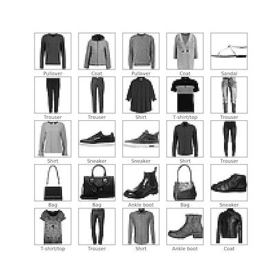

# MNIST Workshop
This is the second of two workshops designed to cover basic use of low level TensorFlow, building and training simple Neural Network.

So far, we saw TensorFlow in use, and tinkered with Neural Network architecture and training.

Next step is to adjust pipeline from the previous workshop for a new dataset - MNIST Fashion dataset.

## Main goal
You should change the model architecture, as well as Trainer class, to work with new data. You will also see how last example applies to the real data application. You will work with tf.Session.

## Workshop guide
Same as before, there are four main parts of the workshop:
* **Dataset** - load - visualize
* **Model** - create tf.Graph with network
* **Training** - train Model on dataset - accuracy
* **TensorBoard** - graph - loss - accuracy

### Dataset
All dataset logic is in `data.py` file.
You don't *need* to look into the code.

Datasets is loaded by calling `get_fashion_mnist()`.

Dataset contains of 28x28 images of clothing items you should classified. Each image is labeled with one of 10 classes:
* T-shirt/top
* Trouser
* Pullover
* Dress
* Coat
* Sandal
* Shirt
* Sneaker
* Bag
* Ankle boot



### Model
There are few things you need to implement/adjust in `model.py`:
* Input placeholder
* Flat features
* New layers
* Output layer for 10 classes
* Training operation

There are more tips in the code where you should implement these.

### Training
Once you change the network you need to adjust `Trainer` in `trainer.py` to feed new data into new placeholders. Consult with the previous workshop and add running tf.Session in both train epoch and valid epoch.

### TensorBoard
Make sure you restart the TensorBoard, now in the *mnist/output* folder:

```
tensorboard --logdir *path_root*/mnist/output
```

You will again have Graph, loss and accuracy.

## So what should you do?

1. Go and implement all TODOs in `model.py` and `trainer.py`
2. Experiment with network layers
3. Edit training parameters if needed in `run.py`
4. See results in [TensorBoard](#TensorBoard)
5. Repeat 1-4 until you have accuracy over 0.9, and continue to get the best you can

### If you still have time

6. Add saving accuracy per class
7. Visualize images that are wrongly classified