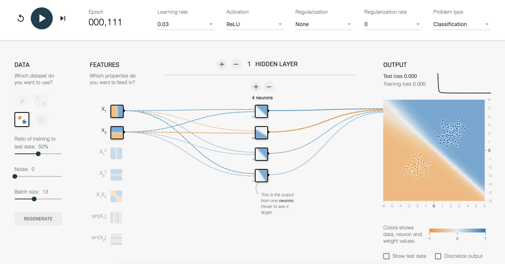
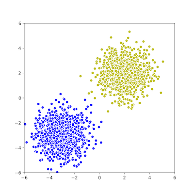
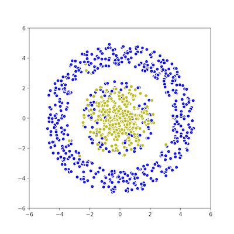
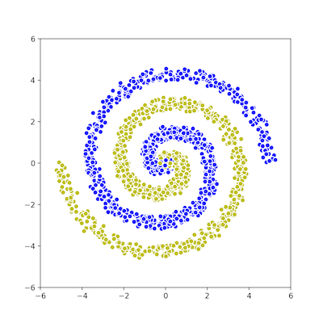
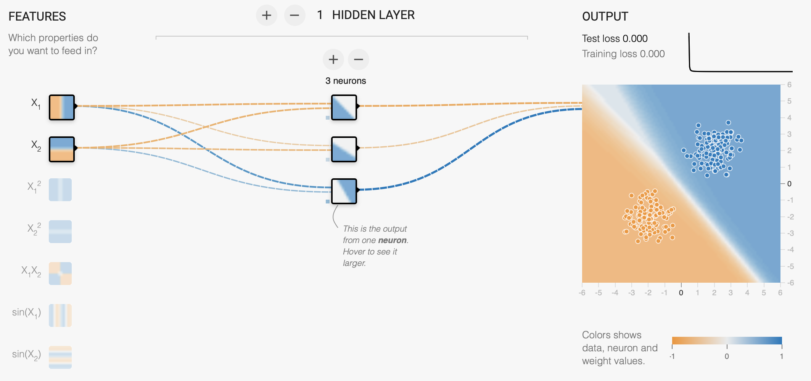
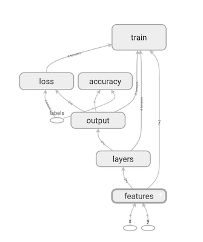
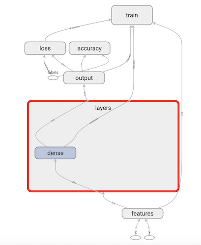

# TensorFlow Playground Workshop
This is the first of two workshops designed to cover basic use of low level TensorFlow APIs, building and training simple neural network.

You will need to experiment with different network architectures: changing **features**, **layers**, **activation functions**; as well as training parameters: **optimizer**, number of **epochs**, **batch size**.

## Main goal
Inspired by TensorFlow's [Neural Network Playground](https://playground.tensorflow.org/), an easy way to tinker with neural networks through simple UI, we provided a similar setup for creating and training in TensorFlow where you can edit and add your own ideas, with the end goal of getting the best results on given datasets.


*Neural Network Playground*

## Workshop guide
There are four main parts of the workshop:
* **Dataset**: generate - split - visualize
* **Model**: create tf.Graph with network
* **Training**: train Model on dataset - output - accuracy
* **TensorBoard**: graph - loss - accuracy - output

### Dataset
All of dataset related logic is in `data.py` file.
You don't *need* to look into the code, as it's mostly Python/NumPy/MatplotLib.

Generated datasets are similar to those seen in Playground. They contain set of 2D points labeled with two classes (plotted in different colors).
You can generate following datasets:
* Gaussian - `generate_data_gauss(numSamples, noise)`



* Xor - `generate_data_xor(numSamples, noise)`


* Circle - `generate_data_circle(numSamples, noise)`



* Spiral - `generate_data_spiral(numSamples, noise)`



You can set which dataset will be used in `run.py`. For each you can edit the number of points generated and the noise factor.

Dataset is being split to train and validation by calling `split_data(all_data, val_factor)`, and you can set different `val_factor` to change the size of validation split.

### Model
Defining tf.Graph with you neural network is done in `model.py`.
There you can find a simple one layer network implemented. It looks like this one in the Playground:



Feel free to try out different ideas in Playground first and then try to implement them in TensorFlow.

You will notice that same network can work well on one dataset and bad on the other.

### Training
We are using `Trainer` class from `trainer.py` for training our model. This is a setup you will see in later workshops as well. `Trainer` is given data and model, and it runs tf.Session to evaluate the Graph you built, on the dataset you feed to it.

For this first workshop you don't *need* to look into the implementation of `Trainer`. Parameters exposed through constructor that you can change in `run.py` are **number of epochs** and **batch size**.

### TensorBoard
[TensorBoard](https://www.tensorflow.org/guide/summaries_and_tensorboard) is a very useful visualization tool for TensorFlow.
You can use it to visualize graph, plot metrics, and show additional data like images.

Every time you run `run.py` one timestamped folder is created in the *tf_playground/output* folder, where we are saving all TensorBoard-readeable summaries.

In a new terminal (with your conda environment activated) run:
```
tensorboard --logdir *path_root*/tf_playground/output
```
and open the link from terminal (usually localhost:6006).

You can take a look at `save_graph_summary` method in `model.py`. We are saving the Graph we defined, and now you can see that Graph in TensorBoard in the GRAPHS tab:



and you can expand scopes to see more operations and tensors:



From the `Trainer` we are also saving loss and accuracy, as well as plotted predictions on validation set through epochs. You can see them in SCALARS and IMAGES tabs.

## So what should you do?

1. Pick a dataset (edit `run.py`)
2. Experiment on [Neural Network Playground](https://playground.tensorflow.org/) to get a sense of the architecture that can perform well on the chosen dataset
3. Make changes to the model (edit `model.py`) in order to implement a desired network
4. Set training parameters (edit `run.py`)
5. See results in [TensorBoard](#TensorBoard)
6. Repeat 1-5 until you beat the highscore
7. Post new highscore to Intro to Tensorflow channel on Teams - each dataset will have a separate thread, and you can reply to your dataset's thread
8. Repeat 1-7
0. Have fun :) (and don't fake your results (ಠ_ಠ))

### Starting scores to beat
* Gauss - 0.9
* Xor - 0.7
* Circle - 0.7
* Spiral - 0.6
